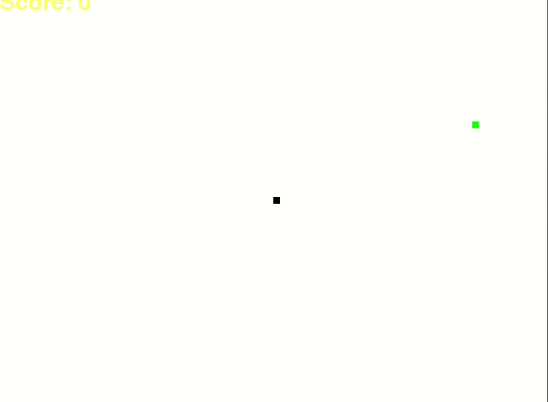

# Code16Challenge
16 lines of code to rule them all, this time simple snake game:
 - 22 tbh
 - not readable at all
 - breaks python formatting rules 
 - and some other stuff
 - __but it works__(kind of)
 
more info: [www.code16challenge.pl](https://www.code16challenge.pl)

## What do you need to run it:
1. python > 3.6
2. pygame package `python3 -m pip install -U pygame --user`
3. execute `python3 main.py`

## Game play
